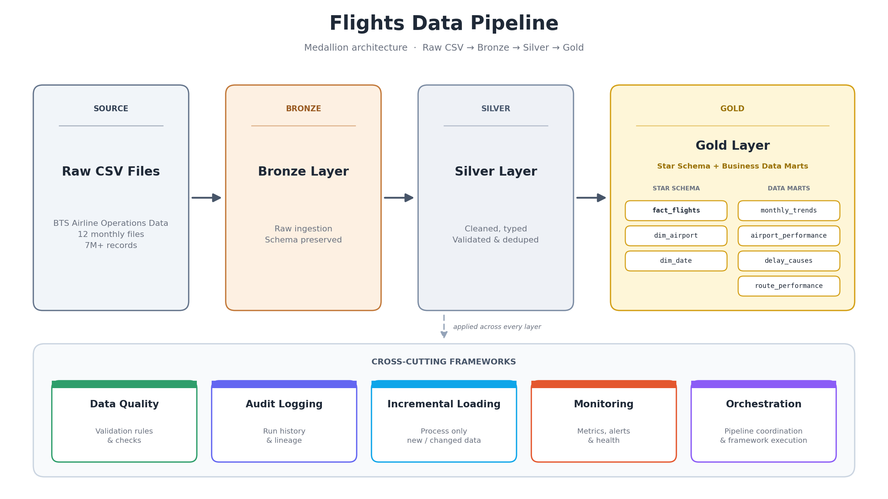

# ✈️ Airline Operations Lakehouse

A production-inspired Data Engineering project built on Databricks using a Medallion Architecture (Bronze, Silver, Gold) to process and analyze U.S. airline operations data.

The project goes beyond traditional ETL pipelines by implementing Data Quality, Audit Logging, Incremental Loading, Monitoring, and Orchestration frameworks commonly used in modern data platforms.

---

# 📌 Project Overview

This project processes airline operations and flight delay data from the U.S. Department of Transportation (DOT/BTS).

The pipeline ingests raw flight data, transforms it through multiple layers, and produces analytical datasets that can be used for operational reporting and performance analysis.

Dataset Size:

- 12 monthly datasets
- 7+ million flight records
- 24 source columns

---

# 🏗️ Architecture



_End-to-end airline operations lakehouse architecture showing data ingestion, Medallion layers, star schema, and operational frameworks._

---

# 🥉 Bronze Layer

Purpose:

- Ingest raw airline data
- Preserve source records
- Apply schema validation
- Remove duplicate records

Key Features:

- Raw data ingestion
- Schema validation
- Duplicate detection
- Delta table storage

Output Table:

```text
bronze.bronze_flights
```

---

# 🥈 Silver Layer

Purpose:

- Clean and standardize data
- Apply business transformations
- Prepare data for analytics

Transformations:

- Date conversion
- Null handling
- Derived columns
- Delay classification

Created Features:

```text
IS_DELAYED
DISTANCE_CATEGORY
```

Output Table:

```text
silver.silver_flights
```

---

# 🥇 Gold Layer

Purpose:

Provide business-ready datasets optimized for analytics and reporting.

Key Outputs:

```text
gold.fact_flights
gold.dim_airport
gold.dim_date
```

Business Metrics:

- Flight delays
- Airport performance
- Route performance
- Monthly trends

---

# ⭐ Star Schema Design

Fact Table:

```text
fact_flights
```

Dimensions:

```text
dim_airport
dim_date
```

Benefits:

- Faster analytical queries
- Simplified reporting
- Scalable warehouse design

---

# ✅ Data Quality Framework

Implemented a reusable Data Quality Framework to validate incoming data.

Checks Include:

- Null value validation
- Duplicate detection
- Business rule validation
- Data freshness checks

Output Table:

```text
gold.data_quality_results
```

---

# 📝 Audit Logging Framework

Tracks pipeline execution metadata.

Captured Metrics:

- Pipeline name
- Start time
- End time
- Runtime
- Rows processed
- Execution status
- Error messages

Output Table:

```text
gold.pipeline_audit
```

---

# 🔄 Incremental Loading Framework

Prevents reprocessing previously loaded files.

Features:

- File tracking
- Metadata management
- New file detection
- Incremental ingestion logic

Output Table:

```text
gold.file_tracker
```

---

# 📊 Pipeline Monitoring Framework

Provides operational visibility into pipeline health.

Metrics Tracked:

- Runtime
- Rows processed
- Failed quality checks
- Quality score

Output Table:

```text
gold.pipeline_metrics
```

---

# 🎯 Platform Orchestration Layer

A centralized orchestration notebook that coordinates operational frameworks and provides an overall pipeline health view.

Responsibilities:

- Quality monitoring
- Audit summary
- Incremental load tracking
- Pipeline health evaluation

---

# 🛠️ Technology Stack

Data Platform:

- Databricks
- Delta Lake

Languages:

- Python
- SQL

Data Processing:

- Apache Spark
- PySpark

Version Control:

- Git
- GitHub

---

# 📂 Project Structure

```text
airline-operations-lakehouse/

├── notebooks/
│   ├── 01_bronze_ingestion.py
│   ├── 02_silver_layer.py
│   ├── 03_gold_layer.py
│   ├── ...
│   └── 11_platform_orchestration.py
│
├── docs/
│
├── sql/
│
├── tests/
│
└── README.md
```

---

# 🚀 Key Data Engineering Concepts Demonstrated

- Medallion Architecture
- Delta Lake
- Star Schema Design
- Data Quality Validation
- Audit Logging
- Incremental Loading
- Pipeline Monitoring
- Data Warehouse Modeling
- Pipeline Orchestration
- PySpark Transformations

---

# 📈 Future Enhancements

Potential improvements:

- Databricks Workflows
- SCD Type 2 Dimensions
- Automated Testing
- CI/CD Integration
- Infrastructure as Code
- Real-Time Streaming Pipelines

---

# 👨‍💻 Author

Fares Bittar

Aspiring Data Engineer focused on building production-oriented data platforms and scalable analytics solutions.
